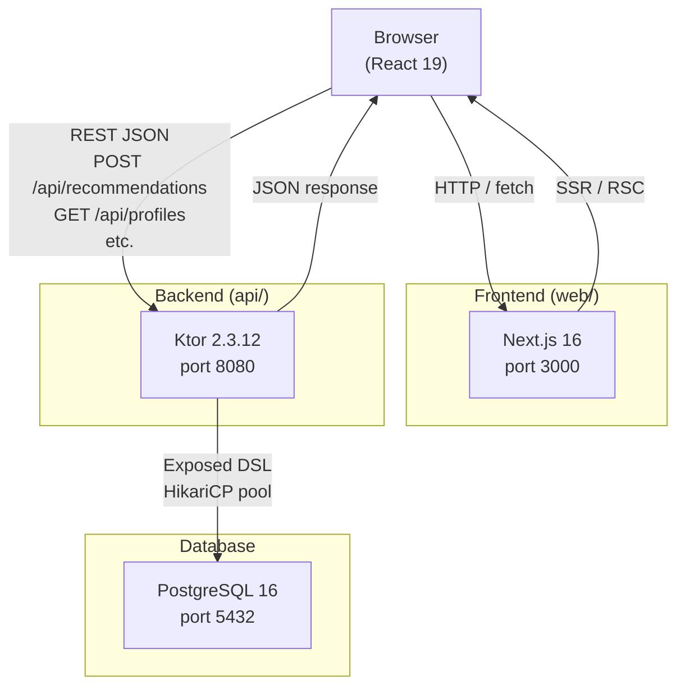
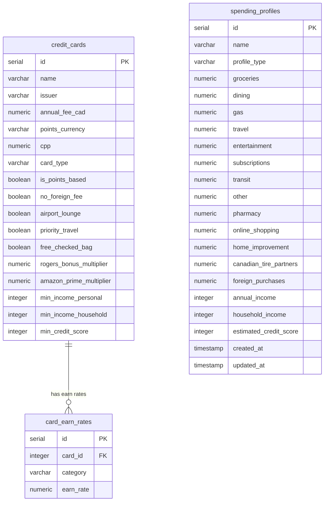
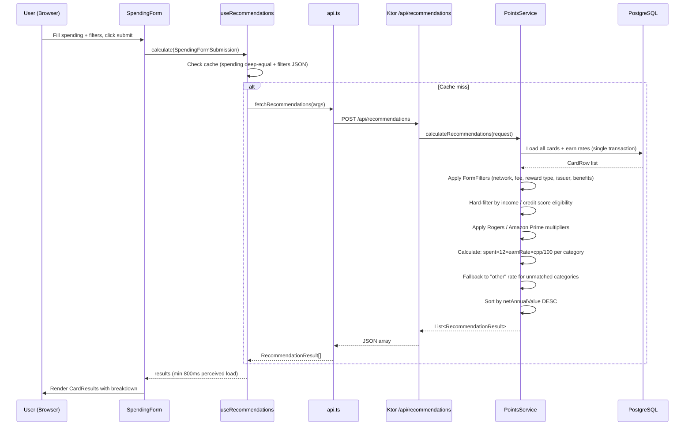
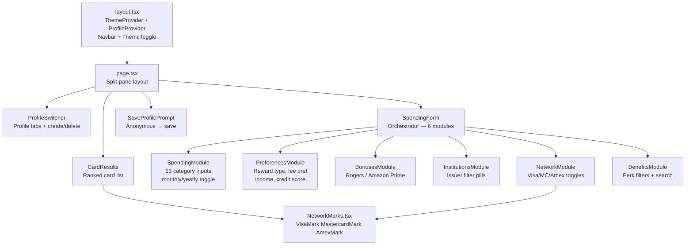
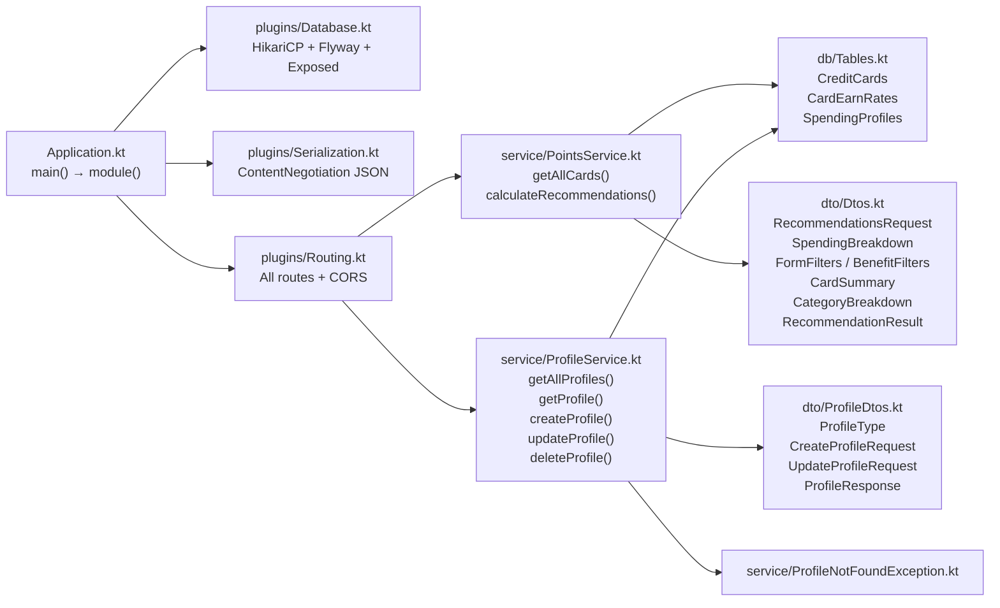

# Project: Canadian Credit Card Points Optimizer

## Project Overview
An AI-powered app to maximize credit card rewards for Canadians based on financial and lifestyle profiles.

## Tech Stack
- **Frontend:** Next.js 16.1.6 (App Router), TypeScript, Tailwind CSS v4, React 19
- **Backend:** Kotlin 1.9.24, Ktor 2.3.12, PostgreSQL 16
- **Database:** Exposed 0.52.0 (DSL + java-time), Flyway 10.15.0, HikariCP 5.1.0
- **Serialization:** kotlinx.serialization (JSON, prettyPrint, isLenient, ignoreUnknownKeys)
- **Environment:** Node 20+, JDK 21 (Java 21 on this machine)

## Build & Development Commands
- **Frontend Dev:** `cd web && npm run dev` (port 3000)
- **Backend Dev:** `cd api && ./gradlew run` (port 8080 — Flyway migrations run automatically on startup)
- **Testing:** `npm test` (Frontend), `./gradlew test` (Backend)
- **PostgreSQL:** Runs as native Windows service `postgresql-x64-16`. Start via `net start postgresql-x64-16` (admin terminal) or `services.msc`.
- **Env var:** `NEXT_PUBLIC_API_URL` defaults to `http://localhost:8080`

---

## Architecture Diagrams

### System Overview



### Database Schema (ER Diagram)



### Recommendation Request Flow



### Frontend Component Tree



### Backend Package Architecture



---

## Architecture & Rules
- **Schema First:** Always check `api/src/main/resources/db/migration` before modifying models.
- **Migrations:** Flyway validates checksums — never edit existing migration files. Add new `V{n}__Description.sql` files only.
- **Flyway 10** requires two artifacts: `flyway-core` + `flyway-database-postgresql`.
- **Naming Conventions:**
    - Frontend: PascalCase for Components, camelCase for hooks/utils.
    - Backend: camelCase for variables/functions, PascalCase for Classes.
- **Points Logic:** All calculation logic lives in `service/PointsService.kt`. Frontend only displays results.
- **API Style:** RESTful JSON. Use `kotlinx.serialization` for DTOs. JSON is configured with `prettyPrint = true`, `isLenient = true`, `ignoreUnknownKeys = true` — null fields are included in responses.
- **Profiles are global** — no user authentication exists. All profiles are shared across sessions.
- **No Auth:** There is no JWT, no login/register, no AuthService. Do not add auth without a dedicated migration and plugin.

---

## Data Model

### Migration History
| Migration | Description |
|-----------|-------------|
| V1 | Create `credit_cards` (7 cols) and `card_earn_rates`; index on earn_rates.card_id |
| V2 | Seed 11 initial cards (Amex Cobalt, Scotiabank Gold, TD, RBC, BMO, CIBC, Rogers, PC Financial, Wealthsimple, etc.) |
| V3 | Create `spending_profiles` with 8 spend columns + `set_updated_at()` trigger |
| V4 | Expand `card_earn_rates.category` to 13 categories; add 5 spend columns to `spending_profiles` |
| V5 | Add 4 boolean benefit columns + 2 bonus multiplier columns to `credit_cards`; backfill values |
| V6 | Add `is_points_based` to `credit_cards`; backfill V4 earn rates; expand catalog to 25 cards |
| V7 | Add eligibility columns to `credit_cards` (min income/credit score) and `spending_profiles`; seed thresholds |
| V8 | Expand catalog from 25 to 52 cards (TD, RBC, BMO, CIBC, Scotia, NatBank, Desjardins, Amex, MBNA, Fido, CTire, HomeTrust, Manulife, Meridian, ATB, EQ Bank) |

### `credit_cards`
| Column | Type | Added | Notes |
|--------|------|-------|-------|
| id | SERIAL PK | V1 | |
| name | VARCHAR(100) | V1 | e.g. "Amex Cobalt" |
| issuer | VARCHAR(100) | V1 | e.g. "American Express" |
| annual_fee_cad | NUMERIC(8,2) | V1 | In CAD |
| points_currency | VARCHAR(50) | V1 | e.g. "Amex MR", "Scene+", "Cash Back" |
| cpp | NUMERIC(6,4) | V1 | Cents per point (e.g. 1.5 = 1.5¢/pt) |
| card_type | VARCHAR(20) | V1 | 'visa', 'mastercard', or 'amex' |
| no_foreign_fee | BOOLEAN | V5 | |
| airport_lounge | BOOLEAN | V5 | |
| priority_travel | BOOLEAN | V5 | |
| free_checked_bag | BOOLEAN | V5 | |
| rogers_bonus_multiplier | NUMERIC(4,2) | V5 | Applied when user owns Rogers products |
| amazon_prime_multiplier | NUMERIC(4,2) | V5 | Applied when user has Amazon Prime |
| is_points_based | BOOLEAN | V6 | TRUE = points currency; FALSE = cash-back |
| min_income_personal | INTEGER nullable | V7 | NULL = no minimum |
| min_income_household | INTEGER nullable | V7 | NULL = no minimum |
| min_credit_score | INTEGER nullable | V7 | NULL = no minimum |

### `card_earn_rates`
| Column | Type | Notes |
|--------|------|-------|
| id | SERIAL PK | |
| card_id | INTEGER FK | References credit_cards(id) |
| category | VARCHAR(30) | See spend categories below |
| earn_rate | NUMERIC(6,2) | Points per CAD spent |

**Spend categories (13 total):** `groceries`, `dining`, `gas`, `travel`, `entertainment`, `subscriptions`, `transit`, `other`, `pharmacy`, `online_shopping`, `home_improvement`, `canadian_tire_partners`, `foreign_purchases`

### `spending_profiles`
| Column | Type | Notes |
|--------|------|-------|
| id | SERIAL PK (IntIdTable) | |
| name | VARCHAR(100) | |
| profile_type | VARCHAR(20) | 'personal', 'business', or 'partner' |
| groceries … foreign_purchases | NUMERIC(10,2) | 13 monthly spend columns (added incrementally V3/V4) |
| annual_income | INTEGER nullable | V7 |
| household_income | INTEGER nullable | V7 |
| estimated_credit_score | INTEGER nullable | V7 |
| created_at / updated_at | TIMESTAMPTZ | Auto-managed by DB trigger `set_updated_at()` |

### Reward Value Formula
`annual_value_CAD = monthly_spend × 12 × earn_rate × cpp / 100`

**"other" category fallback:** If a card has no explicit earn rate for a category, `PointsService` falls back to the card's `other` earn rate rather than skipping. Categories with 0.0 earn rate are excluded from breakdown.

## Eligibility Filtering
Cards are hard-filtered when the user provides income/credit-score inputs:
- **Income:** User qualifies if personal income ≥ `min_income_personal` OR household income ≥ `min_income_household` (either satisfies).
- **Credit score:** Hard-excluded if score < `min_credit_score - 30`. Within the 30-point buffer (`CREDIT_SCORE_SOFT_BUFFER`), an `eligibilityWarning` string is returned instead.
- Visa Infinite tier: $60k personal / $100k household, 680–700 score
- World Elite Mastercard tier: $80k personal / $150k household, 700–760 score

---

## API Endpoints

| Method | Path | Description |
|--------|------|-------------|
| GET | `/health` | Health check → `{ "status": "ok" }` |
| GET | `/api/cards` | All cards (summary list) |
| POST | `/api/recommendations` | Ranked cards for given spending + optional eligibility |
| GET | `/api/profiles` | List all profiles (ordered by createdAt DESC) |
| POST | `/api/profiles` | Create profile (201 Created) |
| GET | `/api/profiles/{id}` | Get single profile |
| PUT | `/api/profiles/{id}` | Partial update profile |
| DELETE | `/api/profiles/{id}` | Delete profile (204 No Content) |

**Error codes:** 400 (invalid JSON / missing required fields), 404 (not found), 422 (validation failure — blank name, invalid profileType).

### POST /api/recommendations
```json
{
  "spending": { "groceries": 500, "dining": 300, "gas": 100, "travel": 200,
                "entertainment": 100, "subscriptions": 50, "transit": 50, "other": 200,
                "pharmacy": 0, "onlineShopping": 0, "homeImprovement": 0,
                "canadianTirePartners": 0, "foreignPurchases": 0 },
  "filters": {
    "rewardType": "both",
    "feePreference": "include_fee",
    "rogersOwner": false,
    "amazonPrime": false,
    "institutions": [],
    "networks": ["visa", "mastercard", "amex"],
    "benefits": { "noForeignFee": false, "airportLounge": false, "priorityTravel": false, "freeCheckedBag": false }
  },
  "annualIncome": 75000,
  "householdIncome": null,
  "estimatedCreditScore": 724
}
```
Also accepts `"profileId": 3` instead of (or to override) `spending`. Response sorted best → worst by `netAnnualValue`:
```json
[{
  "card": { "id": 1, "name": "...", "issuer": "...", "annualFee": 155.88,
            "pointsCurrency": "Amex MR", "cardType": "amex", "isPointsBased": true },
  "breakdown": [{ "category": "groceries", "spent": 6000.0, "pointsEarned": 6000.0, "valueCAD": 90.0 }],
  "totalPointsEarned": 42000.0, "totalValueCAD": 420.0, "netAnnualValue": 264.12,
  "eligibilityWarning": null
}]
```

---

## Package Structure (Backend)
```
com.creditoptimizer
├── Application.kt                # main() → configures Serialization, Database, Routing
├── db/Tables.kt                  # Exposed DSL table objects (CreditCards, CardEarnRates, SpendingProfiles)
├── dto/
│   ├── Dtos.kt                   # RecommendationsRequest, SpendingBreakdown, FormFilters,
│   │                             # BenefitFilters, CardSummary, CategoryBreakdown, RecommendationResult
│   └── ProfileDtos.kt            # ProfileType (constants), CreateProfileRequest, UpdateProfileRequest, ProfileResponse
├── service/
│   ├── PointsService.kt          # getAllCards(), calculateRecommendations(), eligibilityPasses(), passesFilters()
│   ├── ProfileService.kt         # getAllProfiles(), getProfile(), createProfile(), updateProfile(), deleteProfile()
│   └── ProfileNotFoundException.kt
└── plugins/
    ├── Database.kt               # HikariCP pool (max 10) + Flyway migrations + Exposed connection
    ├── Routing.kt                # All 9 endpoints + CORS (allow localhost:3000, GET/POST/PUT/DELETE)
    └── Serialization.kt          # ContentNegotiation JSON (prettyPrint, isLenient, ignoreUnknownKeys)
```

---

## Frontend Component Structure
```
web/app/
├── page.tsx                      # Split-pane layout (sticky left / scrollable right on desktop)
├── layout.tsx                    # Root layout: ThemeProvider > ProfileProvider > navbar + ThemeToggle
├── globals.css                   # Tailwind v4 + Material Design 3 tokens + scrollbar styles
└── components/
    ├── SpendingForm.tsx           # Orchestrator: composes 6 modules, builds FormFilters, submits
    ├── SpendingModule.tsx         # 13 spend categories (monthly/yearly toggle); props: onChange, initialValues?
    ├── PreferencesModule.tsx      # Reward type, fee pref, income (personal/household), credit score; exports Preferences
    ├── BonusesModule.tsx          # Rogers/Fido/Shaw toggle + Amazon Prime toggle; exports Bonuses
    ├── InstitutionsModule.tsx     # Issuer filter pills (Select All/Clear All); exports InstitutionId
    ├── NetworkModule.tsx          # Visa/MC/Amex toggles (min 1 required); uses NetworkMarks
    ├── BenefitsModule.tsx         # 4 perk filters with keyword search; exports BenefitSelection
    ├── CardResults.tsx            # Ranked ResultCard list with breakdown, progress bars, eligibility alerts
    ├── NetworkMarks.tsx           # VisaMark / MastercardMark / AmexMark SVGs (className prop for size)
    ├── ProfileSwitcher.tsx        # Profile tabs + inline create form + hover-delete button
    ├── SaveProfilePrompt.tsx      # One-time anonymous → profile save dialog
    └── ThemeToggle.tsx            # Sun/moon toggle (top-right navbar)

web/
├── context/
│   ├── ProfileContext.tsx         # profiles[], activeProfile, setActiveProfile, createProfile,
│   │                             # saveActiveProfileSpending, removeProfile — hook: useProfile()
│   └── ThemeContext.tsx           # theme ("light"|"dark"), toggleTheme — persists to localStorage
├── hooks/
│   └── useRecommendations.ts     # calculate(), clearResults(), results, isCalculating, error
│                                 # Caches last spending (deep-equal) + filters (JSON); min 800ms load
└── lib/
    └── api.ts                    # All shared types + fetch wrappers
```

**Shared types exported from `api.ts`:**
`ProfileType` · `RewardType` · `FeePreference` · `CardNetwork` · `CardSummary` · `CategoryBreakdown` · `RecommendationResult` · `SpendingBreakdown` · `FormFilters` · `SpendingFormSubmission` · `Profile` · `CreateProfilePayload` · `UpdateProfilePayload`

**Do not re-declare these types in individual components** — import from `@/lib/api`.

**Network mark SVGs** (`VisaMark`, `MastercardMark`, `AmexMark`) are shared via `NetworkMarks.tsx`. Accept a `className` prop for size overrides (defaults: `h-4`/`h-5`/`h-4`).

---

## DB Connection
- Host: localhost:5432
- DB: creditoptimizer
- User: postgres / Password: postgres
- Config read from `application.conf` with those defaults

## Regional Constraints (Crucial)
- Focus ONLY on Canadian credit card issuers: Amex CA, RBC, TD, Scotiabank, BMO, CIBC, National Bank, Desjardins, plus telecom (Rogers, Fido), retailers (PC Financial, Canadian Tire, MBNA/Amazon), and alternative banks (Wealthsimple, EQ Bank, Neo Financial, Home Trust, Manulife, Meridian, ATB).
- Currency is always CAD.
- 52 cards in the catalog (V1–V8 migrations).
