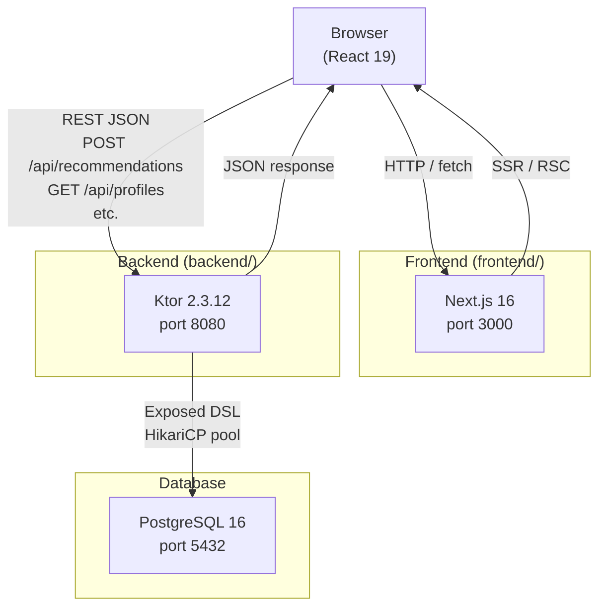
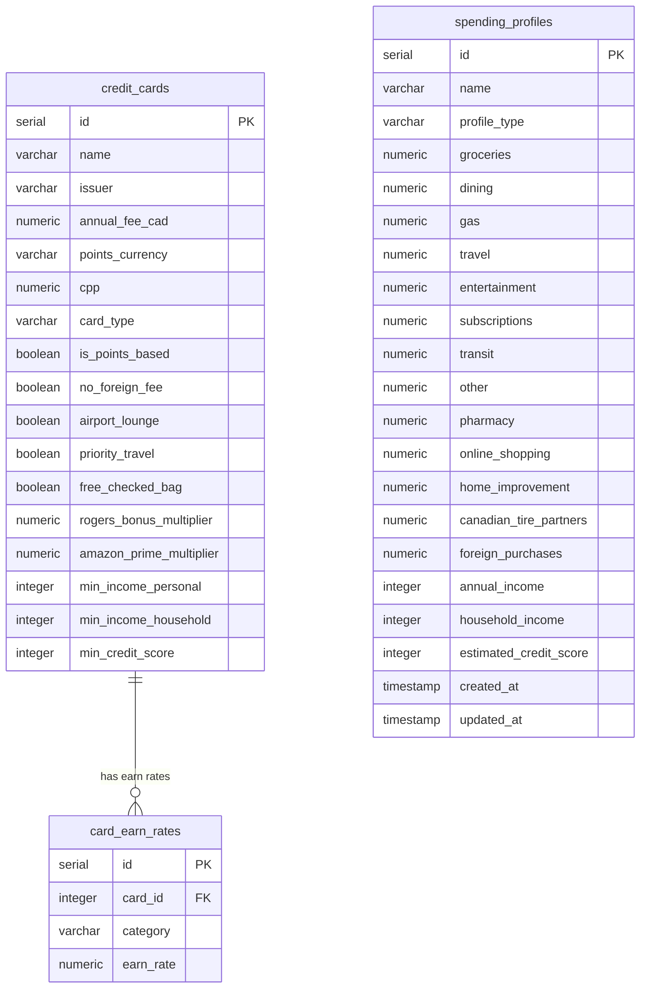
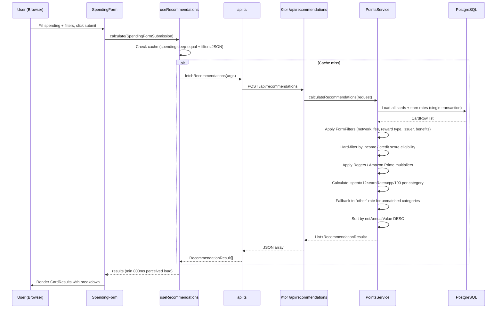
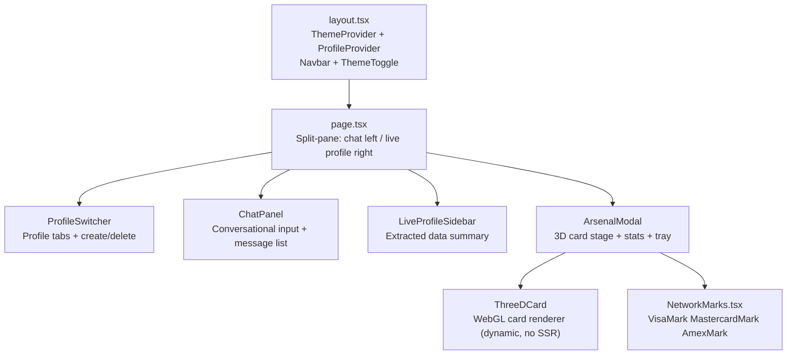
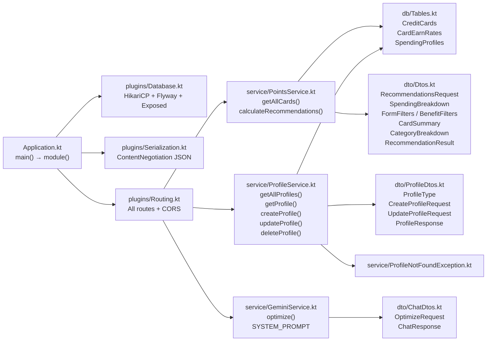

# Project: Canadian Credit Card Points Optimizer

## Project Overview
An AI-powered app to maximize credit card rewards for Canadians based on financial and lifestyle profiles.

## Tech Stack
- **Frontend:** Next.js 16.1.6 (App Router), TypeScript, Tailwind CSS v4, React 19
- **Backend:** Kotlin 1.9.24, Ktor 2.3.12, PostgreSQL 16
- **Database:** Exposed 0.52.0 (DSL + java-time), Flyway 10.15.0, HikariCP 5.1.0
- **Serialization:** kotlinx.serialization (JSON, prettyPrint, isLenient, ignoreUnknownKeys)
- **Environment:** Node 20+, JDK 21 (Java 21 on this machine)

## Build & Development Commands
- **Frontend Dev:** `cd frontend && npm run dev` (port 3000)
- **Backend Dev:** `cd backend && ./gradlew run` (port 8080 — Flyway migrations run automatically on startup)
- **Testing:** `npm test` (Frontend), `./gradlew test` (Backend)
- **PostgreSQL:** Runs as native Windows service `postgresql-x64-16`. Start via `net start postgresql-x64-16` (admin terminal) or `services.msc`.
- **Env var:** `NEXT_PUBLIC_API_URL` defaults to `http://localhost:8080`
- **Gemini API Key:** Set `GEMINI_API_KEY` in `backend/local.properties` or as an environment variable before starting the backend.

---

## Architecture Diagrams

### System Overview



### Database Schema (ER Diagram)



### Recommendation Request Flow



### Frontend Component Tree



### Backend Package Architecture



---

## Architecture & Rules
- **Schema First:** Always check `backend/src/main/resources/db/migration` before modifying models.
- **Migrations:** Flyway validates checksums — never edit existing migration files. Add new `V{n}__Description.sql` files only.
- **Flyway 10** requires two artifacts: `flyway-core` + `flyway-database-postgresql`.
- **Naming Conventions:**
    - Frontend: PascalCase for Components, camelCase for hooks/utils.
    - Backend: camelCase for variables/functions, PascalCase for Classes.
- **Points Logic:** All calculation logic lives in `service/PointsService.kt`. Frontend only displays results.
- **API Style:** RESTful JSON. Use `kotlinx.serialization` for DTOs. JSON is configured with `prettyPrint = true`, `isLenient = true`, `ignoreUnknownKeys = true` — null fields are included in responses.
- **Profiles are global** — no user authentication exists. All profiles are shared across sessions.
- **No Auth:** There is no JWT, no login/register, no AuthService. Do not add auth without a dedicated migration and plugin.

---

## Data Model

### Migration History
| Migration | Description |
|-----------|-------------|
| V1 | Create `credit_cards` and `card_earn_rates` (historical — tables dropped in V9) |
| V2 | Seed 11 initial cards (historical) |
| V3 | Create `spending_profiles` with 8 spend columns + `set_updated_at()` trigger |
| V4 | Add 5 spend columns to `spending_profiles`; expand `card_earn_rates` categories (historical) |
| V5–V8 | Add card benefit/eligibility columns and expand catalog to 52 cards (historical) |
| V9 | **Drop `card_earn_rates` and `credit_cards`** — recommendations moved entirely to Gemini |

### `spending_profiles` (only table remaining after V9)
| Column | Type | Notes |
|--------|------|-------|
| id | SERIAL PK (IntIdTable) | |
| name | VARCHAR(100) | |
| profile_type | VARCHAR(20) | 'personal', 'business', or 'partner' |
| groceries … foreign_purchases | NUMERIC(10,2) | 13 monthly spend columns (added incrementally V3/V4) |
| annual_income | INTEGER nullable | V7 |
| household_income | INTEGER nullable | V7 |
| estimated_credit_score | INTEGER nullable | V7 |
| created_at / updated_at | TIMESTAMPTZ | Auto-managed by DB trigger `set_updated_at()` |

### Reward Value Formula (computed by Gemini)
- Cash-back: `valueCAD = monthly_spend × 12 × rate / 100`
- Points: `pointsEarned = monthly_spend × 12 × earn_rate`, `valueCAD = pointsEarned × cpp / 100`
- `netAnnualValue = totalValueCAD − annualFee`

Gemini enforces eligibility gates (Visa Infinite, World Elite, Amex Platinum income/score thresholds) and returns an `eligibilityWarning` string when applicable.

---

## API Endpoints

| Method | Path | Description |
|--------|------|-------------|
| GET | `/health` | Health check → `{ "status": "ok" }` |
| POST | `/api/chat` | Single-shot Gemini optimization → `{ message, isDone }` |
| GET | `/api/profiles` | List all profiles (ordered by createdAt DESC) |
| POST | `/api/profiles` | Create profile (201 Created) |
| GET | `/api/profiles/{id}` | Get single profile |
| PUT | `/api/profiles/{id}` | Partial update profile |
| DELETE | `/api/profiles/{id}` | Delete profile (204 No Content) |

**Error codes:** 400 (invalid JSON / missing required fields), 404 (not found), 422 (validation failure — blank name, invalid profileType).

### POST /api/chat
Gemini receives the user's raw message (`userText`) and extracts spending, income, credit score, reward type, and fee preference from it. It then calculates all card values internally and returns a `<recommendation_data>` JSON block embedded in `message`.

`recommendation_data` per-card structure:
```json
{
  "name": "Tangerine Money-Back Credit Card",
  "issuer": "Tangerine",
  "annualFee": 0.0,
  "pointsCurrency": "Cash Back",
  "cardType": "mastercard",
  "isPointsBased": false,
  "breakdown": [{ "category": "groceries", "spent": 2400.0, "pointsEarned": 0.0, "valueCAD": 48.0 }],
  "totalPointsEarned": 0.0,
  "totalValueCAD": 92.40,
  "netAnnualValue": 92.40,
  "eligibilityWarning": null,
  "purpose": "No-Fee Cash Back",
  "description": "...",
  "visualConfig": { ... }
}
```

---

## Package Structure (Backend)
```
com.creditoptimizer
├── Application.kt                # main() → configures Serialization, Database, Routing
├── db/Tables.kt                  # Exposed DSL: SpendingProfiles only (card catalog removed in V9)
├── dto/
│   ├── Dtos.kt                   # SpendingBreakdown, FormFilters, BenefitFilters (for OptimizeRequest)
│   ├── ProfileDtos.kt            # ProfileType (constants), CreateProfileRequest, UpdateProfileRequest, ProfileResponse
│   └── ChatDtos.kt               # OptimizeRequest, ChatResponse
├── service/
│   ├── ProfileService.kt         # getAllProfiles(), getProfile(), createProfile(), updateProfile(), deleteProfile()
│   ├── GeminiService.kt          # optimize() — calls Gemini 2.5 Flash, returns ChatResponse with embedded JSON
│   └── ProfileNotFoundException.kt
└── plugins/
    ├── Database.kt               # HikariCP pool (max 10) + Flyway migrations + Exposed connection
    ├── Routing.kt                # 7 endpoints + CORS (allow localhost:3000, GET/POST/PUT/DELETE)
    └── Serialization.kt          # ContentNegotiation JSON (prettyPrint, isLenient, ignoreUnknownKeys)
```

---

## Frontend Component Structure
```
frontend/app/
├── page.tsx                      # Split-pane: chat (left 60%) + live profile sidebar (right 40%)
├── layout.tsx                    # Root layout: ThemeProvider > ProfileProvider > navbar + ThemeToggle
├── globals.css                   # Tailwind v4 + Material Design 3 tokens + scrollbar styles
└── components/
    ├── ChatPanel.tsx              # Conversational input + message list; emits onSendMessage
    ├── ArsenalModal.tsx           # Full-screen modal: 3D card stage + stats grid + card tray
    ├── ThreeDCard.tsx             # WebGL Three.js card renderer (dynamically imported, SSR disabled)
    ├── LiveProfileSidebar.tsx     # Shows extractedData + active profile spending summary
    ├── CardResults.tsx            # Ranked ResultCard list with breakdown, progress bars, eligibility alerts
    ├── NetworkMarks.tsx           # VisaMark / MastercardMark / AmexMark SVGs (className prop for size)
    ├── ProfileSwitcher.tsx        # Profile tabs + inline create form + hover-delete button
    ├── SpendingForm.tsx           # Orchestrator: composes 6 modules, builds FormFilters, submits
    ├── SpendingModule.tsx         # 13 spend categories (monthly/yearly toggle)
    ├── PreferencesModule.tsx      # Reward type, fee pref, income (personal/household), credit score
    ├── BonusesModule.tsx          # Rogers/Fido/Shaw toggle + Amazon Prime toggle
    ├── InstitutionsModule.tsx     # Issuer filter pills (Select All/Clear All)
    ├── NetworkModule.tsx          # Visa/MC/Amex toggles (min 1 required)
    ├── BenefitsModule.tsx         # 4 perk filters with keyword search
    ├── SaveProfilePrompt.tsx      # One-time anonymous → profile save dialog
    └── ThemeToggle.tsx            # Sun/moon toggle (top-right navbar)

frontend/
├── context/
│   ├── ProfileContext.tsx         # profiles[], activeProfile, setActiveProfile, createProfile,
│   │                             # saveActiveProfileSpending, removeProfile — hook: useProfile()
│   └── ThemeContext.tsx           # theme ("light"|"dark"), toggleTheme — persists to localStorage
├── hooks/
│   ├── useChat.ts                 # sendMessage(), messages, isLoading, recommendationData, arsenalCards, isDone
│   │                             # Calls /api/chat, parses <recommendation_data> JSON from Gemini response
│   └── useRecommendations.ts     # calculate(), clearResults(), results, isCalculating, error
│                                 # Caches last spending (deep-equal) + filters (JSON); min 800ms load
└── lib/
    └── api.ts                    # All shared types + fetch wrappers
```

**Shared types exported from `api.ts`:**
`ProfileType` · `RewardType` · `FeePreference` · `CardNetwork` · `CardSummary` · `CategoryBreakdown` · `RecommendationResult` · `SpendingBreakdown` · `FormFilters` · `SpendingFormSubmission` · `ChatMessage` · `ChatResponse` · `OptimizeRequest` · `Profile` · `CreateProfilePayload` · `UpdateProfilePayload`

**Do not re-declare these types in individual components** — import from `@/lib/api`.

**Network mark SVGs** (`VisaMark`, `MastercardMark`, `AmexMark`) are shared via `NetworkMarks.tsx`. Accept a `className` prop for size overrides (defaults: `h-4`/`h-5`/`h-4`).

**Chat → Arsenal flow:** `useChat` sends `OptimizeRequest` to `/api/chat` → Gemini returns `<recommendation_data>` JSON embedded in response → `useChat` parses it into `recommendationData` (SpendingFormSubmission) and `arsenalCards` (name/purpose/description/visualConfig) → `page.tsx` calls `calculate(recommendationData)` → `/api/recommendations` returns ranked results → `ArsenalModal` opens filtered to the Gemini-selected cards.

---

## DB Connection
- Host: localhost:5432
- DB: creditoptimizer
- User: postgres / Password: postgres
- Config read from `application.conf` with those defaults

## Regional Constraints (Crucial)
- Focus ONLY on Canadian credit card issuers: Amex CA, RBC, TD, Scotiabank, BMO, CIBC, National Bank, Desjardins, plus telecom (Rogers, Fido), retailers (PC Financial, Canadian Tire, MBNA/Amazon), and alternative banks (Wealthsimple, EQ Bank, Neo Financial, Home Trust, Manulife, Meridian, ATB).
- Currency is always CAD.
- 52 cards in the catalog (V1–V8 migrations).
