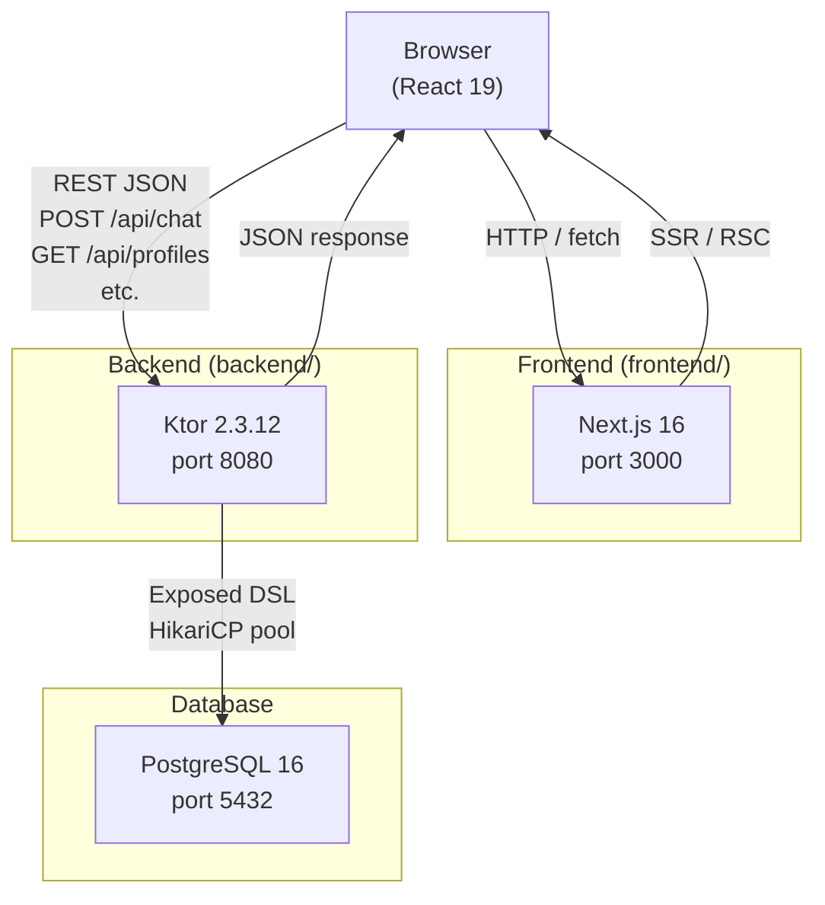
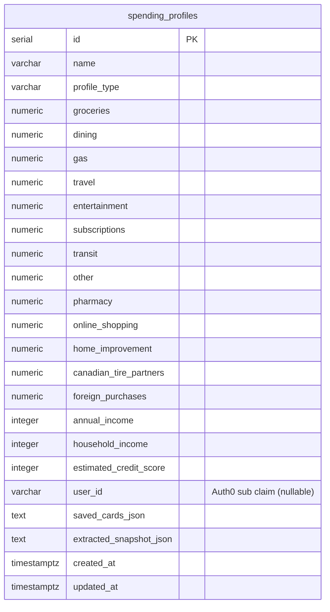
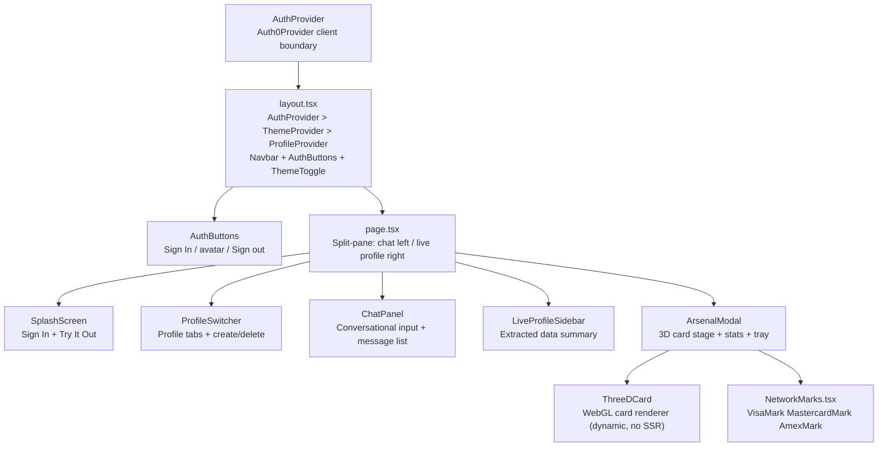
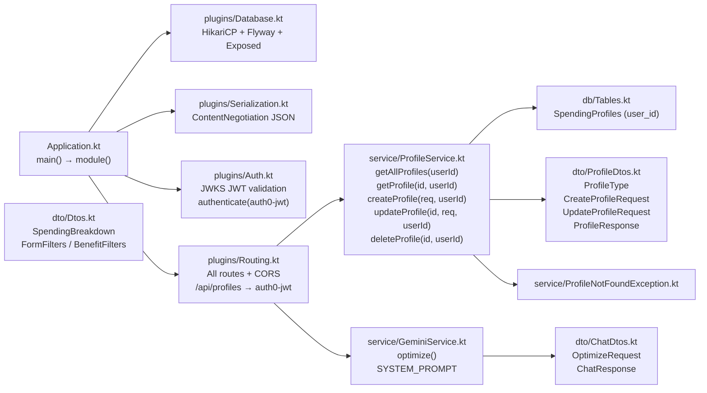

# Project: Canadian Credit Card Points Optimizer

## Project Overview
An AI-powered app to maximize credit card rewards for Canadians based on financial and lifestyle profiles.

## Tech Stack
- **Frontend:** Next.js 16.1.6 (App Router), TypeScript, Tailwind CSS v4, React 19
- **Backend:** Kotlin 1.9.24, Ktor 2.3.12, PostgreSQL 16
- **Database:** Exposed 0.52.0 (DSL + java-time), Flyway 10.15.0, HikariCP 5.1.0
- **Serialization:** kotlinx.serialization (JSON, prettyPrint, isLenient, ignoreUnknownKeys)
- **Environment:** Node 20+, JDK 21 (Java 21 on this machine)

## Build & Development Commands
- **Frontend Dev:** `cd frontend && npm run dev` (port 3000)
- **Backend Dev:** `cd backend && ./gradlew run` (port 8080 — Flyway migrations run automatically on startup)
- **Testing:** `npm test` (Frontend), `./gradlew test` (Backend)
- **PostgreSQL:** Runs as native Windows service `postgresql-x64-16`. Start via `net start postgresql-x64-16` (admin terminal) or `services.msc`.
- **Env var:** `NEXT_PUBLIC_API_URL` defaults to `http://localhost:8080`
- **Gemini API Key:** Set `GEMINI_API_KEY` in `backend/local.properties` or as an environment variable before starting the backend.
- **Auth0 (Frontend):** Create `frontend/.env.local` with `AUTH0_DOMAIN`, `AUTH0_CLIENT_ID`, `AUTH0_CLIENT_SECRET`, `AUTH0_SECRET`, `APP_BASE_URL`, `NEXT_PUBLIC_API_URL`, and `AUTH0_AUDIENCE`. See README for full setup.
- **Auth0 (Backend):** Add `auth0Domain` and `auth0Audience` to `backend/local.properties`. These are read into `application.conf` under `auth0 { domain, audience }`.

---

## Architecture Diagrams

### System Overview



### Database Schema (ER Diagram)



> `credit_cards` and `card_earn_rates` were dropped in V9 — the card catalog now lives entirely inside Gemini.

### Chat / Optimization Flow

```mermaid
sequenceDiagram
    participant U as User (Browser)
    participant CP as ChatPanel
    participant UC as useChat
    participant A as api.ts
    participant K as Ktor /api/chat
    participant GS as GeminiService
    participant G as Gemini 2.5 Flash

    U->>CP: Type message (spending / preferences)
    CP->>UC: sendMessage(text)
    UC->>A: sendOptimizeRequest(OptimizeRequest)
    A->>K: POST /api/chat (no auth required)
    K->>GS: optimize(request)
    GS->>G: system prompt + user message
    G-->>GS: response with <recommendation_data> JSON block
    GS-->>K: ChatResponse { message, isDone }
    K-->>A: JSON
    A-->>UC: ChatResponse
    UC->>UC: parse <recommendation_data> → arsenalCards + recommendationData
    UC-->>CP: messages updated, isDone=true
    CP->>U: render message; ArsenalModal opens with ranked cards
```

### Frontend Component Tree



### Backend Package Architecture



---

## Architecture & Rules
- **Schema First:** Always check `backend/src/main/resources/db/migration` before modifying models.
- **Migrations:** Flyway validates checksums — never edit existing migration files. Add new `V{n}__Description.sql` files only.
- **Flyway 10** requires two artifacts: `flyway-core` + `flyway-database-postgresql`.
- **Naming Conventions:**
    - Frontend: PascalCase for Components, camelCase for hooks/utils.
    - Backend: camelCase for variables/functions, PascalCase for Classes.
- **Points Logic:** All card calculation logic lives inside Gemini (via `GeminiService.kt`). Frontend only displays results.
- **API Style:** RESTful JSON. Use `kotlinx.serialization` for DTOs. JSON is configured with `prettyPrint = true`, `isLenient = true`, `ignoreUnknownKeys = true` — null fields are included in responses.
- **Auth:** Frontend uses `@auth0/nextjs-auth0` v4 (`proxy.ts` pattern — not `middleware.ts`). Backend validates JWTs via JWKS (`plugins/Auth.kt`). `/api/chat` is open to unauthenticated users; all `/api/profiles` routes require a valid Bearer token and scope to the caller's `sub`.
- **Per-user profiles:** All profile service methods accept and filter by `userId` (Auth0 `sub` claim). Unauthenticated create/read/update/delete attempts return 401.
- **Auth0 SDK v4 notes:** Routes live at `/auth/*` (not `/api/auth/*`). Use `Auth0Provider` (not `UserProvider`). `proxy.ts` replaces `middleware.ts`. `httpTimeout: 15000` is required to prevent Edge Runtime discovery timeouts.

---

## Data Model

### Migration History
| Migration | Description |
|-----------|-------------|
| V1 | **Consolidated schema (current).** Creates `spending_profiles` with all 13 spend columns, income/credit fields, `user_id`, `saved_cards_json`, `extracted_snapshot_json`, `set_updated_at()` trigger, and `idx_spending_profiles_user_id` index. All prior migrations (V2–V10) were squashed into this file — **requires a fresh database** (`DROP DATABASE creditoptimizer; CREATE DATABASE creditoptimizer`). |

### `spending_profiles` (sole table)
| Column | Type | Notes |
|--------|------|-------|
| id | SERIAL PK | |
| name | VARCHAR(100) | |
| profile_type | VARCHAR(20) | `'personal'`, `'business'`, or `'partner'` |
| groceries … foreign_purchases | NUMERIC(10,2) | 13 monthly spend columns |
| annual_income | INTEGER nullable | |
| household_income | INTEGER nullable | |
| estimated_credit_score | INTEGER nullable | |
| saved_cards_json | TEXT nullable | JSON array of `SavedCard` objects |
| extracted_snapshot_json | TEXT nullable | Gemini-extracted spending snapshot |
| user_id | VARCHAR(100) nullable | Auth0 `sub` claim; scopes row to a single account |
| created_at / updated_at | TIMESTAMPTZ | `updated_at` auto-managed by DB trigger |

### Reward Value Formula (computed by Gemini)
- Cash-back: `valueCAD = monthly_spend × 12 × rate / 100`
- Points: `pointsEarned = monthly_spend × 12 × earn_rate`, `valueCAD = pointsEarned × cpp / 100`
- `netAnnualValue = totalValueCAD − annualFee`

Gemini enforces eligibility gates (Visa Infinite, World Elite, Amex Platinum income/score thresholds) and returns an `eligibilityWarning` string when applicable.

---

## API Endpoints

| Method | Path | Auth | Description |
|--------|------|------|-------------|
| GET | `/health` | none | Health check → `{ "status": "ok" }` |
| POST | `/api/chat` | none (open) | Single-shot Gemini optimization → `{ message, isDone }` |
| GET | `/api/profiles` | Bearer JWT | List caller's profiles (ordered by createdAt DESC) |
| POST | `/api/profiles` | Bearer JWT | Create profile scoped to caller (201 Created) |
| GET | `/api/profiles/{id}` | Bearer JWT | Get single profile (404 if wrong user) |
| PUT | `/api/profiles/{id}` | Bearer JWT | Partial update profile (404 if wrong user) |
| DELETE | `/api/profiles/{id}` | Bearer JWT | Delete profile (204 No Content; 404 if wrong user) |

**Error codes:** 400 (invalid JSON / missing required fields), 401 (missing or invalid token), 404 (not found or belongs to another user), 422 (validation failure — blank name, invalid profileType).

### POST /api/chat
Gemini receives the user's raw message (`userText`) and extracts spending, income, credit score, reward type, and fee preference from it. It then calculates all card values internally and returns a `<recommendation_data>` JSON block embedded in `message`.

`recommendation_data` per-card structure:
```json
{
  "name": "Tangerine Money-Back Credit Card",
  "issuer": "Tangerine",
  "annualFee": 0.0,
  "pointsCurrency": "Cash Back",
  "cardType": "mastercard",
  "isPointsBased": false,
  "breakdown": [{ "category": "groceries", "spent": 2400.0, "pointsEarned": 0.0, "valueCAD": 48.0 }],
  "totalPointsEarned": 0.0,
  "totalValueCAD": 92.40,
  "netAnnualValue": 92.40,
  "eligibilityWarning": null,
  "purpose": "No-Fee Cash Back",
  "description": "...",
  "visualConfig": { ... }
}
```

---

## Package Structure (Backend)
```
com.creditoptimizer
├── Application.kt                # main() → configures Serialization, Database, Auth, Routing
├── db/Tables.kt                  # Exposed DSL: SpendingProfiles (incl. userId column)
├── dto/
│   ├── Dtos.kt                   # SpendingBreakdown, FormFilters, BenefitFilters (for OptimizeRequest)
│   ├── ProfileDtos.kt            # ProfileType (constants), CreateProfileRequest, UpdateProfileRequest, ProfileResponse
│   └── ChatDtos.kt               # OptimizeRequest, ChatResponse
├── service/
│   ├── ProfileService.kt         # all 5 methods accept userId: String; filter + stamp by user_id
│   ├── GeminiService.kt          # optimize() — calls Gemini 2.5 Flash, returns ChatResponse with embedded JSON
│   └── ProfileNotFoundException.kt
└── plugins/
    ├── Auth.kt                   # install(Authentication) { jwt("auth0-jwt") } via JWKS JwkProviderBuilder
    ├── Database.kt               # HikariCP pool (max 10) + Flyway migrations + Exposed connection
    ├── Routing.kt                # 7 endpoints + CORS; /api/profiles wrapped in authenticate("auth0-jwt")
    └── Serialization.kt          # ContentNegotiation JSON (prettyPrint, isLenient, ignoreUnknownKeys)
```

---

## Frontend Component Structure
```
frontend/
├── proxy.ts                      # Next.js 16 proxy — routes all requests through auth0.middleware()
├── next.config.ts                # Image remote patterns for Google/Auth0 avatars
├── app/
│   ├── page.tsx                  # Split-pane: chat (left 60%) + live profile sidebar (right 40%)
│   ├── layout.tsx                # Root layout: AuthProvider > ThemeProvider > ProfileProvider
│   │                             # navbar + AuthButtons + ThemeToggle
│   ├── globals.css               # Tailwind v4 + Material Design 3 tokens + scrollbar styles
│   └── components/
│       ├── AuthProvider.tsx      # "use client" wrapper for Auth0Provider (required for RSC layout)
│       ├── AuthButtons.tsx       # Sign In link / Google avatar + name / Sign out; reads useUser()
│       ├── SplashScreen.tsx      # Full-screen intro: Sign In → /auth/login; Try It Out → dismiss
│       ├── ChatPanel.tsx         # Conversational input + message list; emits onSendMessage
│       ├── ArsenalModal.tsx      # Full-screen modal: 3D card stage + stats grid + card tray
│       ├── ThreeDCard.tsx        # WebGL Three.js card renderer (dynamically imported, SSR disabled)
│       ├── LiveProfileSidebar.tsx # Shows extractedData + active profile spending summary
│       ├── CardResults.tsx       # Ranked ResultCard list with breakdown, progress bars, eligibility alerts
│       ├── NetworkMarks.tsx      # VisaMark / MastercardMark / AmexMark SVGs (className prop for size)
│       ├── ProfileSwitcher.tsx   # Profile tabs + inline create form + hover-delete; shows sign-in
│       │                         # prompt on 401 ("Sign in to create and save profiles.")
│       ├── SpendingForm.tsx      # Orchestrator: composes 6 modules, builds FormFilters, submits
│       ├── SpendingModule.tsx    # 13 spend categories (monthly/yearly toggle)
│       ├── PreferencesModule.tsx # Reward type, fee pref, income (personal/household), credit score
│       ├── BonusesModule.tsx     # Rogers/Fido/Shaw toggle + Amazon Prime toggle
│       ├── InstitutionsModule.tsx # Issuer filter pills (Select All/Clear All)
│       ├── NetworkModule.tsx     # Visa/MC/Amex toggles (min 1 required)
│       ├── BenefitsModule.tsx    # 4 perk filters with keyword search
│       ├── SaveProfilePrompt.tsx # One-time anonymous → profile save dialog
│       └── ThemeToggle.tsx       # Sun/moon toggle (top-right navbar)
├── context/
│   ├── ProfileContext.tsx        # profiles[], activeProfile, setActiveProfile, createProfile,
│   │                             # saveActiveProfileSpending, removeProfile — hook: useProfile()
│   │                             # Re-fetches on auth state change via useUser(); clears on logout
│   └── ThemeContext.tsx          # theme ("light"|"dark"), toggleTheme — persists to localStorage
├── hooks/
│   ├── useChat.ts                # sendMessage(), messages, isLoading, recommendationData, arsenalCards, isDone
│   │                             # Calls /api/chat (no auth), parses <recommendation_data> JSON from Gemini
│   └── useRecommendations.ts    # calculate(), clearResults(), results, isCalculating, error
│                                 # Caches last spending (deep-equal) + filters (JSON); min 800ms load
└── lib/
    ├── api.ts                    # All shared types + fetch wrappers (profile calls include Bearer token)
    └── auth0.ts                  # Auth0Client singleton (domain, clientId, secret, audience, httpTimeout)
```

**Shared types exported from `api.ts`:**
`ProfileType` · `RewardType` · `FeePreference` · `CardNetwork` · `CardSummary` · `CategoryBreakdown` · `RecommendationResult` · `SpendingBreakdown` · `FormFilters` · `SpendingFormSubmission` · `ChatMessage` · `ChatResponse` · `OptimizeRequest` · `Profile` · `CreateProfilePayload` · `UpdateProfilePayload`

**Do not re-declare these types in individual components** — import from `@/lib/api`.

**Network mark SVGs** (`VisaMark`, `MastercardMark`, `AmexMark`) are shared via `NetworkMarks.tsx`. Accept a `className` prop for size overrides (defaults: `h-4`/`h-5`/`h-4`).

**Chat → Arsenal flow:** `useChat` sends `OptimizeRequest` to `/api/chat` → Gemini returns `<recommendation_data>` JSON embedded in response → `useChat` parses it into `recommendationData` (SpendingFormSubmission) and `arsenalCards` (name/purpose/description/visualConfig) → `page.tsx` calls `calculate(recommendationData)` → `useRecommendations` caches + returns ranked results → `ArsenalModal` opens filtered to the Gemini-selected cards.

---

## DB Connection
- Host: localhost:5432
- DB: creditoptimizer
- User: postgres / Password: postgres
- Config read from `application.conf` with those defaults

## Regional Constraints (Crucial)
- Focus ONLY on Canadian credit card issuers: Amex CA, RBC, TD, Scotiabank, BMO, CIBC, National Bank, Desjardins, plus telecom (Rogers, Fido), retailers (PC Financial, Canadian Tire, MBNA/Amazon), and alternative banks (Wealthsimple, EQ Bank, Neo Financial, Home Trust, Manulife, Meridian, ATB).
- Currency is always CAD.
- The card catalog (52 cards) lives entirely within Gemini's system prompt — there is no card table in the database.
